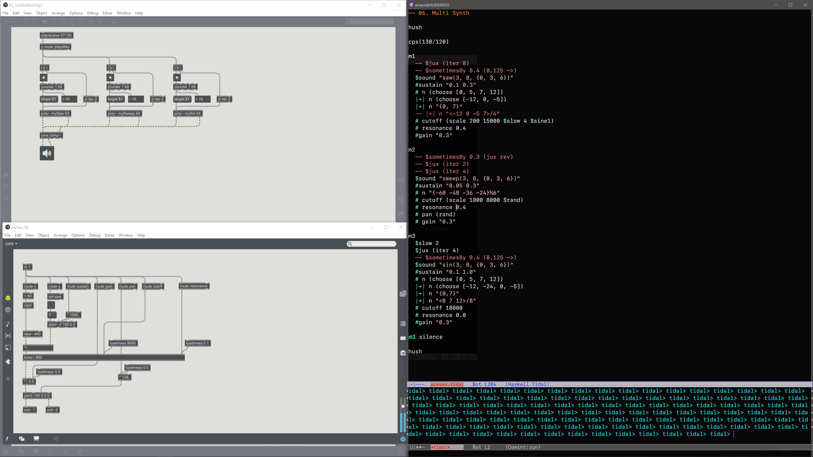

# TidalCycles to MAX



An Haskell package and examples for connecting TidalCycles to Max. 

This package based on mads kjeldgaard (datamads)'s tidal-maxmsp experiments.

- [https://github.com/datamads/tidal-maxmsp](https://github.com/datamads/tidal-maxmsp)

## How to Use

1. You need to install TidalCycles live coding environment on your machine.

   - [TidalCycles](https://tidalcycles.org/)

2. Build and install TidalToMax package

   ```shell
   cabal build
   
   cabal install
   ```

3. Start TidalCycles on your editor and initialize package

   ```haskell
   import Sound.Tidal.TidalToMax
   
   m1 <- maxStream "127.0.0.1" 57130
   
   m2 <- maxStream "127.0.0.1" 57130
   
   m3 <- maxStream "127.0.0.1" 57130
   
   m4 <- maxStream "127.0.0.1" 57130
   
   hush = mapM_ ($ silence)[d1, d2, d3, d4, d5, d6, d7, d8, d9, m1, m2, m3, m4]
   ```

4. Start Max patches and send pattern from TidalCycles

   ```haskell
   -- example
   m1
     $ jux (rev)
     $ sometimesBy 0.2 (0.125 ~>)
     $ sometimesBy 0.3 (jux (0.125 <~))
     $ sound "saw({3, 5}, 8, {0, 2})"
     # sustain "0.05 1.0"
     # n "{0 5 9}%4"
     |-| n "{12, 7, 0}"
     |-| n "<0 4 5 7>/8"
     # cutoff (scale 10 10000 $slow 16 $sine1)
     # resonance (scale 0.0 0.5 $rand)
     # gain "1.0"
   ```

   